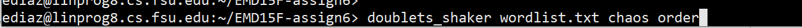

# Doublets-via-Cocktail-Shaker-method
Approaching the graph theory problem through the puzzle game known as doublets or "word ladders.

The game was first started by Lewis Carroll back in the year 1987. The general idea is to take a word and further transform it to a target word through a series of one letter transformations. 

The search algorthim presented here is split into a "forward" search and a "backward" search which is where the "cocktail shaker" term originates from.

