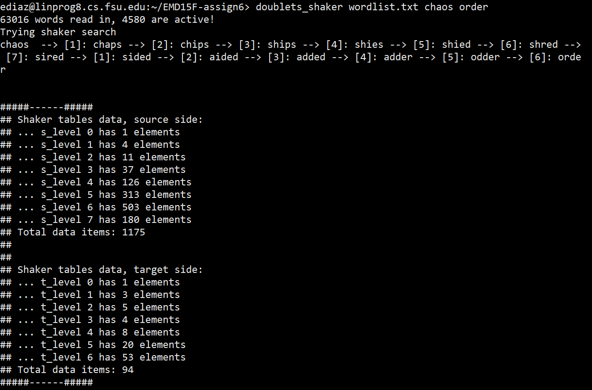

# Doublets-via-Cocktail-Shaker-method
Approaching the graph theory problem through the puzzle game known as doublets or "word ladders.

The game was first started by Lewis Carroll back in the year 1987. The general idea is to take a word and further transform it to a target word through a series of one letter transformations. 

The search algorthim presented here is split into a "forward" search and a "backward" search which is where the "cocktail shaker" term originates from.

When running this program make sure to enter in the appropriate command line arguments. The first argument being the file to open, the second argument being the word from which the word ladder should start with and the third argument being the target word. Both words should be of the same length in order for this algorithm to work properly. 

The “chaos” to “order” example will print out the following output:

The program will provide the word sequence labelled with the respective place that word is in the list. The output also provides insight on the number of different words related to the previous word list by just doing one letter change. It does this both from the source word and the target word.
